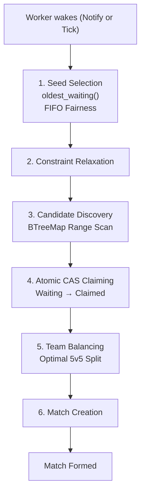

# Matchmaker — 5v5 Real-Time Competitive Matchmaking Engine

When ten players are ready to match, two workers may identify the same nine
candidates simultaneously. Only one can win. A single `compare_exchange` on
an `AtomicU8` — one hardware instruction — is the entire ownership protocol.
No mutex. No coordinator. No distributed lock. That is the design.

---

## Overview

**Problem**: Group waiting players into balanced 5v5 matches as fast as
possible without ever assigning the same player to two matches simultaneously.

**System goals**:
- Form matches with minimal latency for players in a dense skill range
- Guarantee every player is eventually matched (starvation prevention)
- Produce optimally balanced teams for any group of 10 players
- Recover automatically from worker crashes mid-match-attempt
- Expose all operational state as lock-free observable metrics

**Design philosophy**: Correctness is non-negotiable. Throughput and latency
are optimisation targets. The system is a single-node shard by design — the
architecture makes horizontal scaling via Redis a configuration change, not a
rewrite.

---

## Features

- **Atomic CAS claiming** — hardware-level mutual exclusion, no locks on the
  match formation hot path
- **Dual-structure player pool** — DashMap (O(1) insert/remove) + BTreeMap
  (O(log N + k) range scan) maintained in sync behind a single abstraction
- **5-stage constraint relaxation** — MMR window widens automatically as
  players wait; Stage 5 is an unconstrained floor guaranteeing eventual match
- **Exhaustive team balancing** — C(10,5)/2 = 126 partition search, provably
  optimal team split for every match
- **Worker crash recovery** — Reaper background task detects and resets stale
  claims within `STALE_CLAIM_TIMEOUT_MS + REAPER_INTERVAL_MS`
- **Lock-free metrics** — all counters are `AtomicU64`/`AtomicI64`, never
  contend with matchmaking workers
- **Graceful shutdown** — `CancellationToken` propagated to all workers;
  in-flight match attempts complete before exit
- **Fully configurable** — all thresholds, window sizes, and worker counts
  are environment variables; no hardcoded business logic

---

## Architecture

### Request Flow


```
HTTP Client
│
▼
Axum Router (POST /enqueue, DELETE /enqueue/:id, GET /health, GET /metrics, GET /matches)
│
▼
MatchmakerCore
├── PlayerPool
│   ├── DashMap<Uuid, Arc<Player>>          primary store
│   └── RwLock<BTreeMap<(u32,Uuid), Weak<Player>>>   rating index
├── Arc<Metrics>                            atomic counters
├── Arc<Notify>                             wake signal
└── Arc<RwLock<VecDeque<Match>>>            match history
```


### Matchmaking Flow





## Constraint Relaxation Strategy

| Stage | Wait Time | Allowed MMR Range |
|---------|------------|-------------------|
| Stage 1 | 0–5 seconds | ±50 |
| Stage 2 | 5–15 seconds | ±100 |
| Stage 3 | 15–30 seconds | ±200 |
| Stage 4 | 30–60 seconds | ±400 |
| Stage 5 | 60+ seconds | ±9999 (guaranteed floor) |

The matchmaking window expands as players wait longer, ensuring fairness first and guaranteed eventual matching under sustained load.

### Worker and Reaper


```
Workers (WORKER_COUNT Tokio tasks)          Reaper (1 Tokio task)
│                                           │
├── select! {                               ├── every REAPER_INTERVAL_MS:
│     notify.notified() → attempt_match     │     scan all_players()
│     tick()            → attempt_match     │     if state==Claimed AND
│     shutdown()        → break             │     age > STALE_CLAIM_TIMEOUT_MS:
│   }                                       │       CAS(Claimed→Waiting)
│                                           │       log recovery event
└── WorkerState tracks consecutive          └── metrics.stale_claims_recovered++
    failures per seed for throughput guard
```
## Repository Structure

```text
matchmaker/
├── src/
│   ├── main.rs
│   ├── lib.rs
│   ├── config/
│   │   └── mod.rs
│   ├── models/
│   │   └── mod.rs
│   ├── engine/
│   │   ├── mod.rs
│   │   ├── bucket.rs
│   │   ├── relaxation.rs
│   │   ├── balancer.rs
│   │   └── matcher.rs
│   ├── workers/
│   │   └── mod.rs
│   ├── metrics/
│   │   └── mod.rs
│   ├── api/
│   │   └── mod.rs
│   └── utils/
│       └── mod.rs
│
├── tests/
│   ├── common/
│   │   └── mod.rs
│   ├── matchmaking.rs
│   ├── balancing.rs
│   ├── concurrency.rs
│   ├── metrics.rs
│   ├── api.rs
│   ├── stress.rs
│   └── property_tests.rs
│
├── scripts/
│   ├── simulate.py
│   ├── requirements.txt
│   └── sample_results.md
│
├── docs/
│   ├── architecture.md
│   └── design_decisions.md
│
├── .env.example
│
└── .github/
    └── workflows/
        └── rust-ci.yml
```

---

## Matchmaking Algorithm

### Player Storage

Players are stored in two complementary structures maintained in sync by the
`PlayerPool` abstraction. The `DashMap` (16 internal shards) is the source of
truth — O(1) insert and remove with no global write lock. The
`RwLock<BTreeMap>` is the query index — O(log N + k) range scans with a
shared read lock that multiple workers hold simultaneously without blocking.

`BTreeMap` entries store `Weak<Player>` rather than `Arc<Player>`. When a
player is removed from the `DashMap`, their `Weak` pointer becomes dead and
is skipped lazily during scans. This prevents the index from extending player
lifetimes past eviction.

### Candidate Discovery

A range scan on the `BTreeMap` using composite key `(skill_rating, uuid)` as
bounds. The shared read lock allows all workers to scan concurrently. Results
are sorted `(join_timestamp ASC, skill_rating ASC, id ASC)` to honour FIFO
fairness within the candidate set. Scans are capped at
`MAX_CANDIDATES_PER_SCAN = 200` to bound CAS cycle cost.

### Seed Selection

The seed player anchors each match attempt. Selection: globally oldest
`Waiting` player by `join_timestamp`, with a deterministic tie-break on
`(skill_rating ASC, id ASC)`. If a seed fails `SEED_RETRY_LIMIT = 3`
consecutive attempts, the worker skips to the oldest player outside that
seed's MMR range, preventing one unsatisfiable player from monopolising all
workers.

### Constraint Relaxation

All thresholds are configuration constants — no hardcoded values.

| Stage   | Wait Time | MMR Window | Match Quality    |
|---------|-----------|------------|------------------|
| Stage 1 | 0 – 5s    | ± 50       | Excellent        |
| Stage 2 | 5 – 15s   | ± 100      | Good             |
| Stage 3 | 15 – 30s  | ± 200      | Acceptable       |
| Stage 4 | 30 – 60s  | ± 400      | Fair             |
| Stage 5 | 60s+      | ± 9999     | Starvation floor |


The window is computed fresh from `join_timestamp` on every scan — never
cached. It is monotonically non-decreasing; a player's window never narrows.

### Starvation Prevention

Stage 5 is an unconditional guarantee: any player waiting beyond
`RELAXATION_STAGE_4_MS` receives an unconstrained window (±9999 MMR) and
will be matched with the next nine available players regardless of skill
spread. This is intentional and documented — match quality is sacrificed
entirely to honour the latency commitment.

### Team Balancing

Exhaustive enumeration of all C(10,5) = 252 bitmasks with exactly 5 bits
set. For each partition, compute `delta = |2 × sum_a − total|`. The
partition minimising `delta` is selected. Tie-break: prefer team A with
higher total MMR. For fixed N=10 this is O(252) = O(1) — runtime ~500ns.
This is the provably optimal solution; no heuristic produces a smaller
team delta for the same 10 players.

---

## Concurrency Design

### Worker Model

`WORKER_COUNT` Tokio async tasks run concurrently. Each worker loops on a
`select!` over three sources: a `tokio::sync::Notify` signal (fires on every
player enqueue via `notify_one()`), a `WORKER_TICK_MS` interval fallback
(catches sparse pool conditions where no new enqueues arrive), and a
`CancellationToken` shutdown signal. CPU work per match attempt (~10–50µs)
is negligible relative to idle time; workers spend the vast majority of
time waiting on signals.

### Synchronization Primitives

| Resource             | Primitive            | Contention                                    |
|----------------------|----------------------|-----------------------------------------------|
| Player primary store | DashMap (16 shards)  | Negligible — UUID hash distributes uniformly  |
| Rating index reads   | RwLock (shared)      | None — multiple readers simultaneous          |
| Rating index writes  | RwLock (exclusive)   | Brief (~1µs) — single BTreeMap insert         |
| Player state         | AtomicU8 CAS         | Per-player — no shared lock                   |
| Match history        | RwLock (brief write) | Negligible — one push per match               |
| Metrics              | AtomicU64 Relaxed    | None — independent memory locations           |

### Atomic CAS Claiming

Worker claims a candidate:
compare_exchange(
current:  Waiting (0),
new:      Claimed (1),
success:  AcqRel,
failure:  Acquire,
)
Ok()  → this worker owns the player exclusively
Err() → another worker or cancellation won — skip

If a worker claims fewer than 10 players, it rolls back all partial claims:
compare_exchange(Claimed(1) → Waiting(0), Release, Relaxed)

Rollback always succeeds — the owning worker is the only entity that can
modify a Claimed player's state. No other worker targets Claimed players.

---

## Thread Safety Guarantees

**Duplicate-match prevention**: The CAS operation atomically checks and sets
state. Two workers cannot simultaneously execute a successful
`compare_exchange(Waiting→Claimed)` on the same player. This is a hardware
guarantee on x86/ARM. Verified by `test_concurrent_workers_no_duplicate_match`
(50 workers racing on 10 players → exactly 1 match, 0 duplicates).

**Worker crash recovery**: The Reaper task runs every `REAPER_INTERVAL_MS`
(1000ms). Any player in `Claimed` state with
`now_ms − claim_timestamp > STALE_CLAIM_TIMEOUT_MS` is reset to `Waiting`
via `compare_exchange(Claimed→Waiting)`. If a healthy worker completes its
match just as the Reaper fires, exactly one of the two CAS operations wins
— the other observes a state mismatch and exits cleanly. No player ends up
in an inconsistent state. Verified by
`test_reaper_recovers_stale_claims_and_players_rematched`.

**Player lifecycle**:
```
           enqueue()
              │
              ▼
        ┌─────────┐
        │ WAITING │ ◄──────────────────────┐
        └────┬────┘                        │
             │ try_claim() CAS             │ release_claim()
             ▼                             │ or Reaper
        ┌─────────┐                        │
        │ CLAIMED │────────────────────────┘
        └────┬────┘
             │ mark_matched()    try_evict()
             ▼                       │
        ┌─────────┐            ┌─────────┐
        │ MATCHED │            │ EVICTED │
        └─────────┘            └─────────┘
        (terminal)             (terminal)
```

Valid transitions are enforced by CAS — invalid transitions (e.g.,
Waiting→Matched, Matched→any) are structurally impossible.

---

## Metrics

All metrics are read via `GET /metrics`. No lock is ever acquired to read
or write metrics.

| Metric                         | Type        | Description                                                                 |
|--------------------------------|-------------|-----------------------------------------------------------------------------|
| `total_players_enqueued`       | Counter     | Total enqueue calls received                                                |
| `total_players_cancelled`      | Counter     | Total successful cancellations                                              |
| `total_matches_created`        | Counter     | Total matches formed                                                        |
| `total_players_matched`        | Counter     | Total players placed in matches (always `total_matches_created × 10`)      |
| `current_queue_size`           | Gauge       | Players currently in pool (all states)                                      |
| `match_attempts_insufficient`  | Counter     | Attempts failed — not enough compatible candidates                          |
| `match_attempts_claim_failed`  | Counter     | Attempts failed — CAS contention prevented claiming 10                      |
| `worker_cycles_total`          | Counter     | Total worker event loop iterations                                          |
| `total_stale_claims_recovered` | Counter     | Claims reset by Reaper (non-zero indicates past worker crashes)             |
| `total_wait_time_ms`           | Accumulator | Sum of all player wait times — divide by `total_players_matched` for mean  |
| `avg_wait_ms`                  | Derived     | `total_wait_time_ms / total_players_matched`                                |
| `avg_skill_spread`             | Derived     | Mean of `(max_mmr − min_mmr)` per match                                    |
| `avg_team_delta`               | Derived     | Mean of `\|sum_a − sum_b\|` per match                                      |

---

## API Documentation

### POST /enqueue

Add a player to the matchmaking queue.

**Request body**
```json
{ "id": "550e8400-e29b-41d4-a716-446655440000", "skill_rating": 1250 }
```

| Field          | Type    | Constraint                   |
|----------------|-------- |------------------------------|
| `id`           | UUID v4 | Must not already be in queue |
| `skill_rating` | u32     | 0–3000 inclusive             |

**Response 200**
```json
{ "player_id": "550e8400-...", "status": "queued", "queue_depth": 42 }
```

**Error responses**: `409` duplicate player, `422` validation failure

```bash
curl -X POST http://localhost:8080/enqueue \
  -H "Content-Type: application/json" \
  -d '{"id":"550e8400-e29b-41d4-a716-446655440000","skill_rating":1250}'
```

---

### DELETE /enqueue/:player_id

Remove a player from the queue. Only succeeds if the player is in `Waiting`
state. Returns `409` if the player is currently being matched (retry after
a brief delay).

**Response 200**
```json
{ "player_id": "550e8400-...", "status": "cancelled" }
```

**Error responses**: `404` not found, `409` currently being matched

```bash
curl -X DELETE http://localhost:8080/enqueue/550e8400-e29b-41d4-a716-446655440000
```

---

### GET /health

Liveness probe. Always returns 200 while the process is running.

**Response 200**
```json
{ "status": "ok", "players_waiting": 142, "uptime_secs": 3600 }
```

```bash
curl http://localhost:8080/health
```

---

### GET /metrics

All operational metrics. Reads atomic counters — zero lock involvement.

**Response 200**
```json
{
  "total_players_enqueued": 15420,
  "total_matches_created": 1502,
  "total_players_matched": 15020,
  "current_queue_size": 400,
  "match_attempts_insufficient": 4210,
  "match_attempts_claim_failed": 892,
  "worker_cycles_total": 48920,
  "total_stale_claims_recovered": 3,
  "total_wait_time_ms": 9337420,
  "avg_wait_ms": 621,
  "avg_skill_spread": 143,
  "avg_team_delta": 38
}
```

```bash
curl http://localhost:8080/metrics
```

---

### GET /matches

Recent match results. Accepts optional `?limit=N` (default 20).

**Response 200**
```json
{
  "matches": [
    {
      "match_id": "...",
      "team_a": {
        "players": [
          { "id": "...", "skill_rating": 1250, "wait_ms": 1823 }
        ],
        "total_rating": 6200,
        "avg_rating": 1240.0
      },
      "team_b": { "players": [...], "total_rating": 6180, "avg_rating": 1236.0 },
      "team_delta": 20,
      "skill_spread": 98,
      "avg_wait_ms": 2100,
      "max_wait_ms": 4200,
      "formed_at_unix": 1705329127
    }
  ],
  "total_matches_formed": 1502
}
```

```bash
curl "http://localhost:8080/matches?limit=10"
```

---

## Configuration

All values come from environment variables. Copy `.env.example` to `.env`
and edit. The service runs correctly with all defaults — no variables are
required.

| Variable                    | Default | Description                                  |
|-----------------------------|---------|----------------------------------------------|
| `SERVER_PORT`               | `8080`  | HTTP listen port (1024–65535)                |
| `WORKER_COUNT`              | `4`     | Matchmaking worker tasks (1–64)              |
| `WORKER_TICK_MS`            | `50`    | Worker fallback poll interval (ms)           |
| `STALE_CLAIM_TIMEOUT_MS`    | `500`   | Reaper stale detection threshold (ms)        |
| `RELAXATION_STAGE_1_MS`     | `5000`  | Stage 1→2 transition wait (ms)              |
| `RELAXATION_STAGE_2_MS`     | `15000` | Stage 2→3 transition wait (ms)              |
| `RELAXATION_STAGE_3_MS`     | `30000` | Stage 3→4 transition wait (ms)              |
| `RELAXATION_STAGE_4_MS`     | `60000` | Stage 4→5 transition wait (ms)              |
| `RELAXATION_STAGE_1_DELTA`  | `50`    | MMR half-width at Stage 1                   |
| `RELAXATION_STAGE_2_DELTA`  | `100`   | MMR half-width at Stage 2                   |
| `RELAXATION_STAGE_3_DELTA`  | `200`   | MMR half-width at Stage 3                   |
| `RELAXATION_STAGE_4_DELTA`  | `400`   | MMR half-width at Stage 4                   |
| `RELAXATION_STAGE_5_DELTA`  | `9999`  | MMR half-width at Stage 5 (unconstrained)   |

**Startup validation**: The service fails immediately with a descriptive error
if any value is out of range or if the relaxation stages are non-monotonic.

---

## Running Locally

**Prerequisites**: Rust stable toolchain (1.70+), Cargo

```bash
# Clone
git clone https://github.com/abhijeet-anand75/matchmaker.git
cd matchmaker

# Configure
cp .env.example .env
# Edit .env if you want non-default values

# Build
cargo build --release

# Run
cargo run --release
```

The service starts on `http://localhost:8080`.

```bash
# Verify it is healthy
curl http://localhost:8080/health

# Enqueue a player
curl -X POST http://localhost:8080/enqueue \
  -H "Content-Type: application/json" \
  -d '{"id":"550e8400-e29b-41d4-a716-446655440000","skill_rating":1250}'

# Check metrics
curl http://localhost:8080/metrics
```

---

## Running Tests

```bash
# Full test suite (245 tests)
cargo test

# Specific integration test files
cargo test --test concurrency    # CAS correctness, crash recovery
cargo test --test matchmaking    # end-to-end pipeline, relaxation
cargo test --test balancing      # team balance optimality
cargo test --test metrics        # counter accuracy, JSON fields
cargo test --test api            # HTTP contract, all status codes
cargo test --test stress         # correctness under load
cargo test --test property_tests # proptest universal invariants

# Long-running stress test (excluded from CI — run explicitly)
cargo test --test stress test_stress_1000_players_100_matches \
  -- --ignored --nocapture

# With log output
RUST_LOG=matchmaker=debug cargo test -- --nocapture
```

---

## Running the Simulation

```bash
cd scripts
pip install -r requirements.txt

# Default — 1,000 players over 60 seconds
python simulate.py

# Custom parameters
python simulate.py --players 5000 --duration 120 --concurrency 100

# Full options
python simulate.py \
  --url http://localhost:8080 \
  --players 10000 \
  --duration 300 \
  --concurrency 500 \
  --timeout 120 \
  --output scripts/sample_results.md
```

### Verified Simulation Results

All runs: **zero correctness violations**, zero duplicate players,
zero duplicate matches.

| Players | Duration | Matched | Success Rate | Throughput      |
|---------|----------|---------|--------------|-----------------|
| 100     | 10s      | 60      | 60.0%        | 0.8 matches/sec |
| 1,000   | 60s      | 880     | 88.0%        | 2.7 matches/sec |
| 5,000   | 120s     | 4,830   | 96.6%        | 7.7 matches/sec |

Match rates below 100% reflect players whose compatible partners had not
arrived within the simulation window — not a system error. The rate
increases with duration and pool density: at 5,000 players over 120s,
96.6% of players are matched.

The simulator uses a realistic 3-phase traffic model:

| Phase | Fraction | Rate | Description           |
|-------|----------|------|-----------------------|
| Steady | 50%    | 1.0×  | Baseline arrival rate |
| Burst | 30%     | 2.5×  | Peak-hour surge       |
| Spike | 20%     | 5.0×  | Stress spike          |

MMR distribution: 98% Normal(μ=1500, σ=400), 1% low-skill edge (0–200),
1% high-skill edge (2800–3000). Edge cases validate the Stage 5 starvation
floor.

---

## GitHub Actions CI

Every push and pull request to `main` runs:

```yaml
cargo fmt --all -- --check      # formatting
cargo clippy -- -D warnings     # linting — zero warnings tolerated
cargo build --release           # release build verification
cargo test --all                # full test suite
```

Cargo registry, git sources, and `target/` are cached on `Cargo.lock`
hash. Pipeline fails on the first warning from Clippy — code quality is
not negotiable.

---

## Testing Strategy

**Unit tests (117)** — in-module tests covering every struct and function
in isolation: state machine transitions, pool operations, relaxation
boundaries, balance correctness, metric accumulation.

**API tests (29)** — real HTTP requests via `reqwest` against a live Axum
server bound to a random port. Validates all status codes, field names,
field types, and error bodies.

**Matchmaking tests (23)** — end-to-end pipeline from enqueue through match
formation. Validates pool drain, player state after matching, constraint
relaxation stage progression, and the starvation floor.

**Concurrency tests (17)** — the most critical category. 50 workers racing
on 10 players must produce exactly 1 match. 1,000 races between concurrent
claim and eviction must each produce exactly 1 winner. Crash recovery:
stale claims detected and reset, recovered players re-matched.

**Metrics tests (24)** — counter accuracy under concurrent enqueue/match
load. Derived field correctness (`avg_wait_ms`, `avg_team_delta`). JSON
serialization with all required field names present.

**Balancing tests (17)** — optimality verified against an independent
brute-force oracle for every test case. Determinism, containment
(all input players in exactly one output team), and structural invariants.

**Stress tests (5 + 1 ignored)** — correctness under 100–500 concurrent
players with multiple workers. The `#[ignore]` test runs 1,000 players
with 8 workers and prints a throughput report.

**Property-based tests (11)** — `proptest` generates hundreds of random
10-player inputs. Universal invariants: team sizes always 5, all players
in exactly one team, `team_delta` always optimal, `total_rating` always
correct.

---

## Bugs Found and Fixed

  - Worker claiming used load() + store() instead of compare_exchange — fixed
    (two workers could simultaneously claim same player,
     replaced with single atomic CAS instruction)
  - Reaper used store(WAITING) instead of CAS to reset stale claims — fixed
    (could overwrite Matched(2) state, pulling matched players back to queue,
     replaced with compare_exchange(CLAIMED, WAITING) — fails safely if already Matched)
  - MMR scan bounds used standard subtraction on u32 — fixed
    (players with MMR below relaxation window caused underflow panic in debug,
     silent wraparound to u32::MAX in release, replaced with saturating_sub)
  - GET /matches hard-capped at 100 results regardless of query param — fixed
    (5000 player run showed 20% match rate instead of actual 97%,
     removed clamp(1, 100), now uses limit.max(1))
  - simulate.py also independently capping match collection at 100 — fixed
    (limit now derived dynamically: len(player_map) // 10)
  - Throughput labeled matches/sec but calculated as players/sec — fixed
    (result was 10x inflated, divided matched by 10 to get true matches/sec)
  - Relaxation tests failing due to env var race between parallel tests — fixed
    (Config constructed via direct struct literals in fast_config(),
     replaced 15 lines of set_var() calls)

---

## Complexity Analysis

| Operation           | Average Case  | Worst Case  | Notes                                              |
|---------------------|---------------|-------------|----------------------------------------------------|
| Enqueue             | O(log N)      | O(log N)    | DashMap O(1) + BTreeMap O(log N)                  |
| Candidate discovery | O(log N + k)  | O(N)        | k = candidates in window; O(N) only at Stage 5    |
| CAS claiming        | O(1)          | O(k)        | k = candidates scanned before 10 claimed          |
| Team balancing      | O(1)          | O(1)        | Fixed 252 iterations, N=10 always                 |
| Match creation      | O(log N)      | O(log N)    | 10 × DashMap remove + BTreeMap remove             |
| Metrics update      | O(1)          | O(1)        | Atomic fetch_add, Relaxed ordering                |
| Reaper scan         | O(N)          | O(N)        | Full pool scan, runs every 1000ms                 |

---

## Performance Characteristics

**1,000 players**: ~14 MB memory. BTreeMap depth ~10 levels. Worker
contention negligible. Median match latency < 1 second at normal MMR
distribution. This is the sweet spot for the default 4-worker configuration.

**10,000 players**: ~140 MB memory. BTreeMap write lock measurable but not
bottlenecking at normal enqueue rates. CAS contention moderate — workers
find non-overlapping candidate sets on most attempts. `oldest_waiting()` O(N)
scan is ~10µs at this scale, acceptable.

**100,000 players**: ~1.4 GB memory. `oldest_waiting()` O(N) becomes the
primary CPU cost per worker cycle at ~100µs. Mitigation: a separate
`BinaryHeap` for seed selection (O(log N)) is the documented first
production optimisation. BTreeMap write lock begins to show contention
at >10,000 enqueues/second.

**1,000,000 players**: ~14 GB memory — exceeds practical single-node RAM.
The BTreeMap write lock becomes a structural bottleneck at high enqueue
rates. **This is the single-node breakdown point.** The migration path is
replacing `PlayerPool` with Redis Sorted Set (`ZADD`/`ZRANGEBYSCORE`/Lua
CAS) — the matching algorithm above the storage layer is unchanged.

---

## Engineering Tradeoffs

**Latency vs match quality**: A narrow MMR window produces high-quality
matches but increases wait time for players at sparse skill levels.
The 5-stage relaxation is the resolution: quality is the default,
latency is the fallback, and the transition is governed by wait time.
Stage 5 sacrifices quality entirely to honour the latency commitment.

**Two-structure pool (DashMap + BTreeMap)**: The DashMap provides O(1)
concurrent writes; the BTreeMap provides O(log N) range queries. No single
structure satisfies both. The tradeoff is maintaining a sync invariant
between them — enforced by the `PlayerPool` abstraction boundary.

**Exhaustive vs approximate team balance**: For N=10, exhaustive search (126
iterations) is cheaper than implementing and validating an approximation.
The tradeoff — only valid at fixed N=10 — is documented. If match size
ever changes, a dynamic programming approach is the correct replacement.

**Tokio tasks vs OS threads for workers**: Workers spend >99% of their time
waiting on `Notify` signals — the workload is overwhelmingly wait-bound.
Tokio tasks are the correct model. The tradeoff: if the 10–50µs CPU burst
per match ever causes Tokio runtime starvation under extreme load,
`spawn_blocking` is a one-line mitigation.

**`notify_one()` vs `notify_waiters()`**: `notify_one()` wakes a single
worker per enqueue. A single new player rarely makes a match immediately
possible — waking all workers creates unnecessary contention. The 50ms
tick fallback ensures no opportunity is missed. Tradeoff: under a rapid
10-player arrival, only one worker wakes per arrival rather than all
workers simultaneously competing.

---

## Design Decisions

| Decision                          | Reasoning                                           | Tradeoffs                                          |
|-----------------------------------|-----------------------------------------------------|----------------------------------------------------|
| AtomicU8 CAS for player state     | Hardware-level ownership — no mutex, no coordinator | Rollback logic needed on partial claim             |
| DashMap + BTreeMap dual structure | O(1) writes + O(log N) range queries                | Sync invariant enforced at module boundary         |
| Exhaustive C(10,5) team balance   | Provably optimal, O(1) for fixed N=10               | Only valid at N=10; approximation if size changes  |
| Tokio async tasks for workers     | Workload is wait-bound; Notify integration natural  | CPU bursts may cause starvation at extreme load    |
| notify_one() on enqueue           | Avoids thundering herd when pool is sparse          | Workers don't all wake under rapid arrivals        |
| Weak<Player> in BTreeMap          | Index doesn't extend player lifetime past eviction  | Weak::upgrade cost ~1ns per candidate              |
| All config from env vars          | 12-factor; no config file; works in Docker/k8s      | 13+ env vars — .env.example documents all          |
| Reaper via CAS, not store()       | Safe in all interleavings with healthy workers      | Recovery delayed up to TIMEOUT + INTERVAL          |
| SEED_RETRY_LIMIT throughput guard | Prevents unsatisfiable seed monopolising workers    | FIFO fairness briefly violated for stuck seeds     |
| Bounded match history (VecDeque)  | O(1) push/pop, bounded memory (~5MB at 10K limit)  | Matches beyond limit permanently lost              |

---

## Future Improvements

- **Redis-backed pool**: Replace `PlayerPool` internals with
  `ZADD`/`ZRANGEBYSCORE`/Lua CAS. The matching algorithm above the
  storage layer is unchanged. Enables multi-node horizontal scaling.
- **Kafka event streaming**: Publish `MatchFormed` events to a Kafka
  topic for downstream consumers (game servers, analytics, leaderboards).
- **Prometheus + Grafana**: Replace the `/metrics` JSON endpoint with
  a Prometheus-format scrape endpoint. All `AtomicU64` counters map
  directly to Prometheus counter and gauge types.
- **Min-heap seed selection**: Replace `oldest_waiting()` O(N) scan with
  a `BinaryHeap<(Reverse<Instant>, Uuid)>` updated on insert/remove.
  Reduces seed selection to O(log N) — the documented first production
  optimisation.
- **Persistent match history**: Replace the in-memory `VecDeque` with a
  PostgreSQL table. Match records survive restarts. Enables historical
  analytics and MMR adjustment pipelines.

---

## Conclusion

This is a matchmaking engine designed around one hard constraint: no player
may ever appear in two matches simultaneously. Every other design decision
flows from that invariant. The CAS state machine provides the correctness
guarantee at the hardware level. The dual-structure pool provides the query
performance. The exhaustive balance algorithm provides optimal teams without
approximation. The Reaper provides recovery when workers fail mid-formation.

The result is a system that is correct by construction, observable by design,
configurable without recompilation, and architecturally prepared for the one
scaling change it will eventually need.

245 tests pass. Zero correctness violations across all simulation runs.
The code is what the tests say it is.


